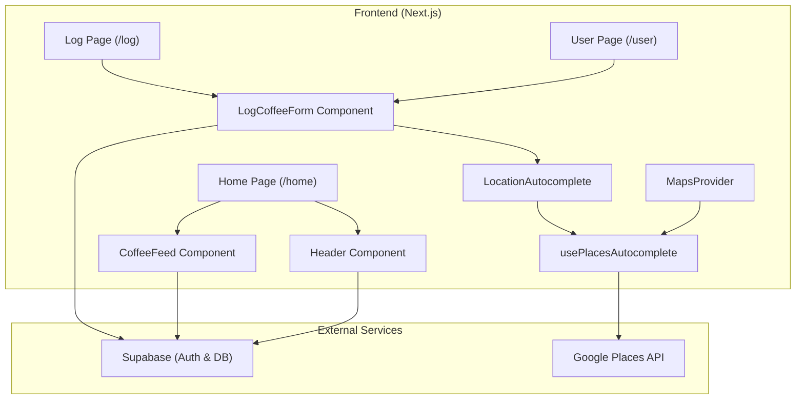

# imnotupyet.com Technical Documentation (V2)

This document provides a comprehensive technical overview of the **imnotupyet.com** coffee logging application. It is intended for maintainers, auditors, and developers to understand the architecture, data flow, and cost-safety designs of the system.

---

## 1. Architectural Map

The application follows a modular React architecture with a clear separation between UI, logic, and data layers.

### Data Flow Ownership
- **LogCoffeeForm**: Owns the overall form state and Supabase persistence logic.
- **LocationAutocomplete**: Owns the UI for location selection and bridges the hook to the form.
- **usePlacesAutocomplete**: Owns the direct interaction with Google Maps SDK and session token lifecycle.
- **Supabase**: Owns user identity and permanent record storage.

---

## 2. Detailed File Documentation

### 2.1 UI / Forms

#### [LogCoffeeForm.tsx](file:///c:/Users/Aradhana%20Saha/OneDrive/Desktop/coffee/components/features/LogCoffeeForm.tsx)
- **File Purpose**: The central hub for creating and editing coffee logs. It handles complex validation, suggestions, and multi-table persistence.
- **Responsibilities**:
    - Managing form state for coffee name, place, rating, review, and flavor notes.
    - Implementing a curated canonical coffee list for suggestions.
    - Handling "Home Brew" logic to bypass location requirements.
    - Orchestrating the "Get or Create" pattern for locations in Supabase.
- **Key State & Variables**:
    - `formData`: Object containing core log details.
    - `isHomeBrew`: Boolean toggle for home-brewed coffee.
    - `selectedLocation`: Object storing temporary Google Place details before persistence.
    - `COMMON_COFFEE_NAMES`: A static curated list of 38 canonical coffee types.
- **Main Logic Flow**:
    1. User interacts with inputs (Coffee Name/Place).
    2. Coffee Name triggers local filtering against `COMMON_COFFEE_NAMES`.
    3. Place triggers [LocationAutocomplete](file:///c:/Users/Aradhana%20Saha/OneDrive/Desktop/coffee/components/features/LocationAutocomplete.tsx#21-118) (or "Home Brew" toggle).
    4. On Submit:
        - If not Home Brew, it checks for an existing location in Supabase by `google_place_id`.
        - If missing, it inserts the new location.
        - Finally, it inserts/updates the `coffee_logs` entry with the `location_id`.
- **External Dependencies**: `supabaseClient`, [LocationAutocomplete](file:///c:/Users/Aradhana%20Saha/OneDrive/Desktop/coffee/components/features/LocationAutocomplete.tsx#21-118), [MapsProvider](file:///c:/Users/Aradhana%20Saha/OneDrive/Desktop/coffee/components/features/MapsProvider.tsx#7-21).
- **Failure Modes**: Guards against missing authentication by checking `supabase.auth.getUser()` before submission. Uses `maybeSingle()` to safely handle location lookups.

#### [LocationAutocomplete.tsx](file:///c:/Users/Aradhana%20Saha/OneDrive/Desktop/coffee/components/features/LocationAutocomplete.tsx)
- **File Purpose**: Provides a custom-styled, accessible dropdown for Google Places search.
- **Responsibilities**:
    - Rendering the search input and prediction list.
    - Handling focus and click-outside events.
    - Communicating selections back to the parent form.
- **Key State & Variables**:
    - `inputValue`: Local state for the text shown in the input.
    - `showDropdown`: Controls visibility of the prediction list.
- **Main Logic Flow**:
    1. User focuses input -> Hook initializes a session.
    2. User types -> Hook fetches predictions.
    3. User selects -> Hook fetches full details and calls `onLocationSelect`.
- **External Dependencies**: [usePlacesAutocomplete](file:///c:/Users/Aradhana%20Saha/OneDrive/Desktop/coffee/hooks/usePlacesAutocomplete.ts#22-143).
- **Failure Modes**: Implements a `disabled` prop for "Home Brew" mode, preventing API calls and visual clutter.

### 2.2 Hooks

#### [usePlacesAutocomplete.ts](file:///c:/Users/Aradhana%20Saha/OneDrive/Desktop/coffee/hooks/usePlacesAutocomplete.ts)
- **File Purpose**: Encapsulates the complex logic of Google Places session management and API interaction.
- **Responsibilities**:
    - Lazy initialization of Google Maps services.
    - Management of `AutocompleteSessionToken`.
    - Debouncing keystrokes to minimize API calls.
- **Key State & Variables**:
    - `sessionToken` (useRef): Stores the current billing session token.
    - `autocompleteService` (useRef): Google SDK service for predictions.
    - `placesService` (useRef): Google SDK service for place details.
- **Main Logic Flow**:
    1. `onInputFocus` creates a new `AutocompleteSessionToken` if one doesn't exist.
    2. `onInputChange` debounces the input and calls `getPlacePredictions` with the token.
    3. `onPlaceSelect` calls `getDetails` with the **same** token, then clears it.
- **External Dependencies**: Google Maps JavaScript SDK.

### 2.3 Providers

#### [MapsProvider.tsx](file:///c:/Users/Aradhana%20Saha/OneDrive/Desktop/coffee/components/features/MapsProvider.tsx)
- **File Purpose**: Loads the Google Maps JavaScript SDK script once for the entire application.
- **Responsibilities**:
    - Injecting the `<script>` tag with the correct API key and libraries (`places`).
    - Ensuring the SDK is available before components attempt to use it.
- **External Dependencies**: `@react-google-maps/api`.

### 2.4 Pages & Routing

#### Home Page (`/home`)
- **Purpose**: The main dashboard for authenticated users.
- **Logic**: Checks for a valid session and a completed profile (username). Redirects to `/login` or `/set-username` as needed. Renders the `CoffeeFeed` and `LogCoffeeAction`.

#### User Page (`/user`)
- **Purpose**: Personal profile management and history view.
- **Logic**: Fetches the user's own logs. Handles username updates (with a 30-day cooldown) and provides the interface for editing or deleting logs.

#### Log Page (`/log`)
- **Purpose**: A dedicated full-screen interface for logging a new coffee.
- **Logic**: Simple wrapper around [LogCoffeeForm](file:///c:/Users/Aradhana%20Saha/OneDrive/Desktop/coffee/components/features/LogCoffeeForm.tsx#41-482).

---

## 3. Billable API Usage & Cost-Safety Design

### Google Places API
The application uses the Google Places API, which is a billable service. To ensure cost-efficiency, we have implemented **Session-Based Billing**.

#### How Session-Based Billing Works
Google charges for Autocomplete in two ways:
1. **Per Request**: Every single keystroke is a separate billable event.
2. **Per Session**: Multiple keystrokes + one "Place Details" call are bundled into a single, cheaper SKU.

#### Our Implementation Strategy
- **AutocompleteSessionToken**: We use the `google.maps.places.AutocompleteSessionToken` class.
- **useRef for Persistence**: The token is stored in a `useRef`. This is critical because it persists across re-renders (as the user types) without being recreated.
- **Lifecycle Rules**:
    - **Creation**: A token is created only when the user focuses the input or starts typing.
    - **Reuse**: The **same** token is passed to every `getPlacePredictions` call and the final `getDetails` call.
    - **Reset**: The token is set to `null` immediately after a selection is made or the input is cleared. This ensures the next search starts a fresh session.
- **Keystroke Debouncing**: We implement a 300ms debounce. If a user types quickly, we only send the final string to Google, further reducing noise.

> [!IMPORTANT]
> **Verification Note**: You cannot verify session billing simply by looking at the Network tab in DevTools. While you will see the `sessiontoken` parameter in the URLs, the actual billing consolidation happens on Google's backend. To audit costs, you must check the **Google Cloud Console -> Billing -> Reports** and filter by the **Autocomplete (per session)** SKU.

---

## 4. How Everything Connects

### Data Flow Direction
1. **User Input**: Captured in [LocationAutocomplete](file:///c:/Users/Aradhana%20Saha/OneDrive/Desktop/coffee/components/features/LocationAutocomplete.tsx#21-118).
2. **Logic Processing**: [usePlacesAutocomplete](file:///c:/Users/Aradhana%20Saha/OneDrive/Desktop/coffee/hooks/usePlacesAutocomplete.ts#22-143) handles the API handshake.
3. **State Sync**: [LogCoffeeForm](file:///c:/Users/Aradhana%20Saha/OneDrive/Desktop/coffee/components/features/LogCoffeeForm.tsx#41-482) receives the final [PlaceDetails](file:///c:/Users/Aradhana%20Saha/OneDrive/Desktop/coffee/hooks/usePlacesAutocomplete.ts#14-21).
4. **Persistence**: [LogCoffeeForm](file:///c:/Users/Aradhana%20Saha/OneDrive/Desktop/coffee/components/features/LogCoffeeForm.tsx#41-482) talks to Supabase to store the record.

### Ownership & Separation
- **UI Components** are "dumb" and only handle display and user events.
- **Hooks** are "smart" and handle external service logic.
- **Database Logic** is centralized in the form to ensure data integrity (e.g., ensuring a location exists before linking a log to it).

---

## 5. User Experience Flow (End-to-End)

1. **Initiation**: User clicks "Log a Coffee" on the Home page.
2. **Coffee Identity**: User types "Capu...". The form suggests "Cappuccino" from the canonical list. If they misspell it, a "Did you mean?" prompt appears.
3. **Location Choice**:
    - **Option A (Café)**: User types "Blue Tokai". [usePlacesAutocomplete](file:///c:/Users/Aradhana%20Saha/OneDrive/Desktop/coffee/hooks/usePlacesAutocomplete.ts#22-143) fetches results. User selects the correct branch.
    - **Option B (Home)**: User toggles "Home Brew". The Place field is locked to "Home Brew" and Google APIs are bypassed.
4. **Qualitative Input**: User selects a "Price feel" and a star rating. They add flavor notes like "Nutty" or "Bitter".
5. **Submission**:
    - The app verifies the user is logged in.
    - If a café was selected, it ensures that café's details are in the `locations` table.
    - A new entry is created in `coffee_logs`.
6. **Completion**: The user is redirected back to the Home feed, which refreshes to show their new entry at the top.

---

**Documentation Version**: 2.0.0  
**Last Updated**: January 10, 2026
